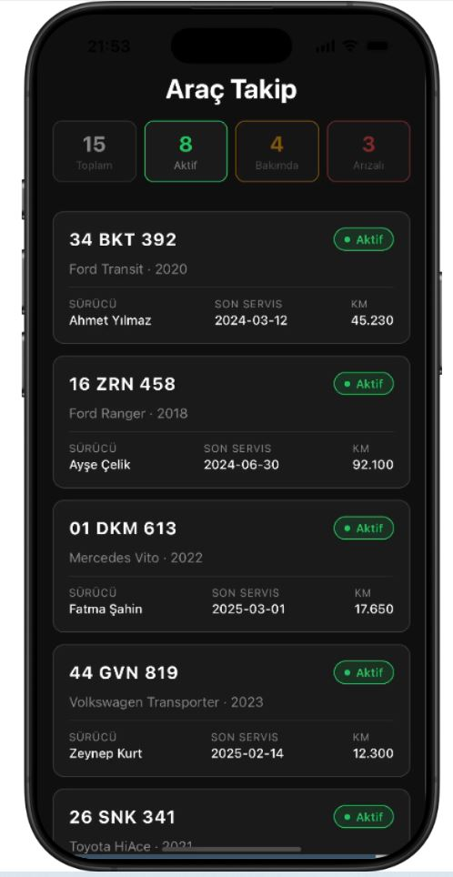
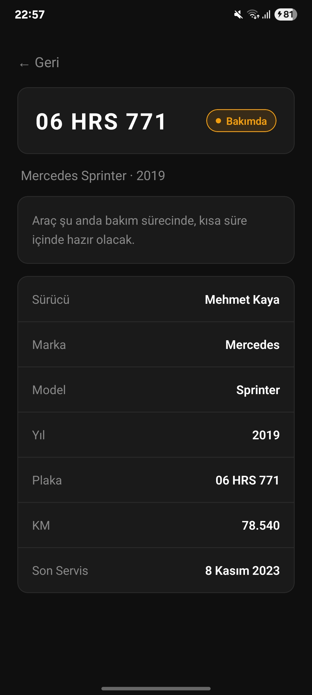
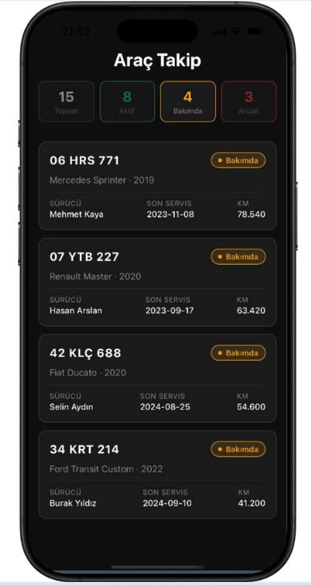
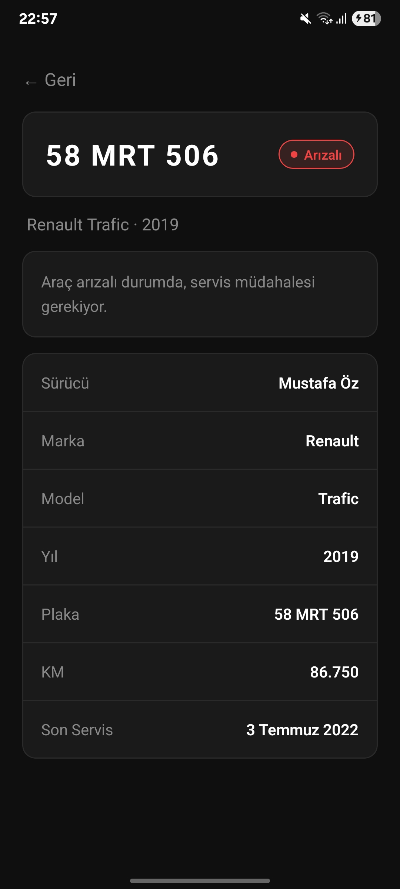
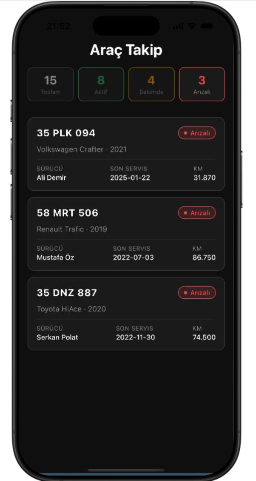
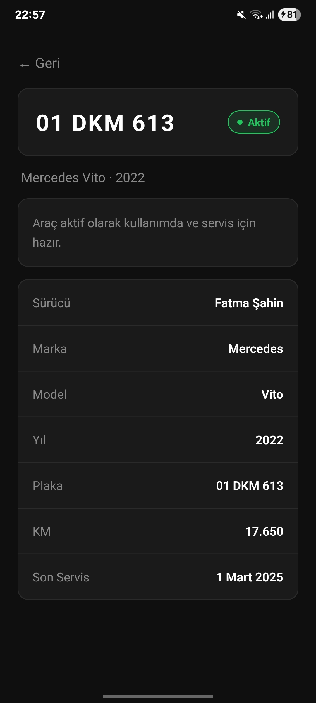

https://github.com/user-attachments/assets/d19f6a4d-7100-4d39-b2c8-be53759b50b5


https://github.com/user-attachments/assets/81777c9f-2de3-44d7-9b7a-0ee9d5c45ba9

# React Native Araç Durum Takip Ekranı

React Native · Expo · TypeScript ile geliştirilmiş araç filo takip uygulaması.

## Özellikler

- Araç listesi (FlatList) — plaka, model, sürücü, KM, son servis tarihi
- Durum badge'leri — Aktif (yeşil), Bakımda (sarı), Arızalı (kırmızı)
- Pull-to-refresh ile veri yenileme
- Skeleton loading animasyonu
- Hata durumu yönetimi ve retry butonu
- Araç detay sayfası (slide-in animasyonlu geçiş)
- Duruma göre filtreleme (Toplam / Aktif / Bakımda / Arızalı)
- AsyncStorage ile offline cache desteği
- TypeScript ile tip güvenliği
- iOS ve Android uyumlu

## Kurulum

### Gereksinimler

- Node.js 18+
- Expo Go (iOS veya Android)

### Adımlar

```bash
git clone https://github.com/ruveydaisikk/React-Native-Arac-Takip-Mobil.git
cd React-Native-Arac-Takip-Mobil
npm install
npx expo start
```

Terminalde QR kod çıkacak. Expo Go uygulamasını açıp QR kodu tarayın.

## Teknoloji Stack

- React Native
- Expo SDK 54
- TypeScript
- React Navigation (Native Stack)
- AsyncStorage
- Animated API

## Test Edilen Platformlar

- **Android** — Samsung Galaxy gerçek cihazda Expo Go uygulaması ile test edildi
- **iOS** — iPhone 16 Pro Simulator, Expo Snack üzerinden tarayıcıda test edildi → [iOS Snack Linki](https://snack.expo.dev/@ruveyda38756/07778a?platform=ios)

## Ekran Görüntüleri

| Android | iOS |
|---------|-----|
|  | &nbsp; |  |
|  | &nbsp; |  |
|  | &nbsp; |  |
|  | &nbsp; |  |
|  | &nbsp; |  |
|  | &nbsp; |  |
|  | &nbsp; |  |


## Bonus Özellikler

- ✅ Araç detay sayfasına animasyonlu geçiş (kart press animasyonu + slide-in)
- ✅ AsyncStorage ile offline cache — son başarılı veri kaydedilir
- ✅ Duruma göre özet sayaçlar — tıklayınca filtreleme yapar
- ✅ TypeScript tip güvenliği
